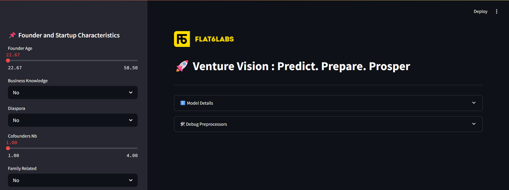
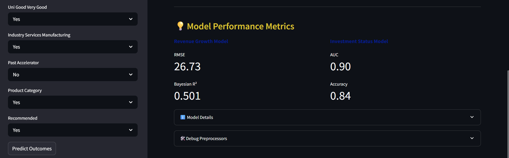
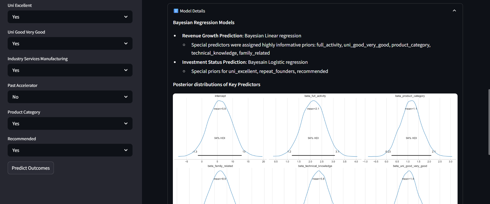
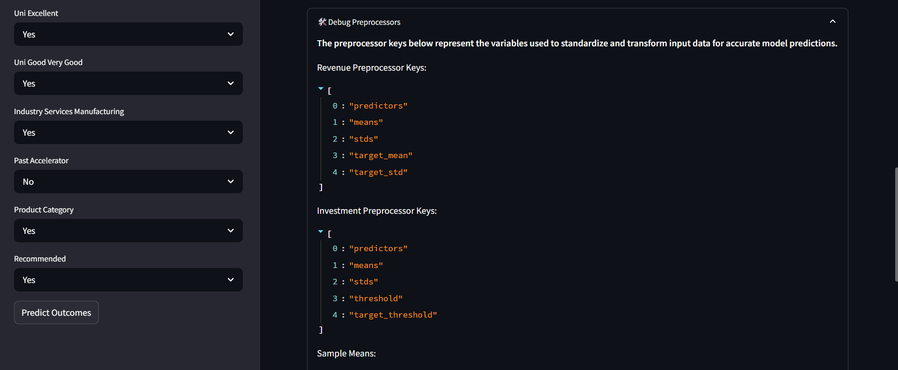

# Project Title: What Fuels the Seed? Bayesian Insights From Tunisia

**Predicting early-stage venture performance using a hybrid Bayesian modeling approach.**

## 📖 Project Overview
This project examines how **founder and startup characteristics influence early-stage venture performance** within the Tunisian entrepreneurial ecosystem. Using data from **75 startups backed by Flat6Labs Tunisia (2017–2022)**, it predicts two key outcomes: **revenue growth** and **external investment acquisition**.  

A **hybrid modeling approach** combining regression analysis and Bayesian methods allows robust predictions despite limited data and high variability. Results emphasize the importance of **founder full-time commitment, educational background, technical expertise, and ecosystem support**.  

This study provides a **probabilistic, evidence-based evaluation framework** that helps investors, accelerators, and policymakers make more informed decisions in emerging markets.

---

## 🛠️ Tech Stack
- **Python Libraries:**
  - Data manipulation: `pandas`, `numpy`  
  - Visualization: `matplotlib`, `seaborn`, `streamlit`
  - Statistical analysis: `scipy.stats`, `patsy`, `sklearn.preprocessing` (`skew`, `boxcox`, `yeojohnson`, `boxcox1p`)  
  - Bayesian modeling: `pymc`, `arviz`, `pytensor`  

---

## 🔍 Key Steps
1. **Data Cleaning & Preprocessing** – Handle missing values, encode categorical data, normalize features.  
2. **Exploratory Data Analysis (EDA)** – Visualize trends, correlations, and insights.  
3. **Predictive Modeling** – Train and evaluate hybrid regression and Bayesian models.  
4. **Results & Insights** – Highlight key drivers of venture success and actionable recommendations.  

---

## 📈 Key Results
- Provided **probabilistic predictions** of revenue growth and funding acquisition for early-stage startups.  
- Found **founder full-time commitment, educational background, technical expertise, and ecosystem support** are significant predictors of success.  
- Developed **dashboard and visualization tools** for actionable insights.

---

## 📊 Dashboard Preview

Here’s a preview of the interactive dashboard developed in this project:






- These visual outputs support data-driven decision-making by presenting both predicted values and associated uncertainty. 
- Indicators such as RMSE, Bayesian R², AUC, and accuracy provide transparent insight into model performance.  
- The dashboard includes an **expander** to explain the Bayesian modeling approach, including regression types (linear for revenue, logistic for investment) and key predictors with informative priors.  
- The **debugging preprocessors** section exposes feature-wise means and standard deviations calculated during model training to ensure consistent input scaling and correct interpretation of predictions. Target variable statistics and thresholds are also included to revert scaled predictions to their original scale.

---

## 📂 Setup Instructions
```markdown
### 1. Clone the repository
```bash
git clone https://github.com/hyba-ab/startup-success-modeling.git
   
git clone https://github.com/hyba-ab/startup-success-modeling.git
```
```markdown
### 2. Navigate to the project folder
```bash
cd startup-success-modeling
```
```markdown
### 3. (Optional) Create a virtual environment
```bash
python -m venv venv
source venv/bin/activate (Linux/macOS)
venv\Scripts\activate (windows)
```
```markdown
### 4. Install dependencies
```bash
pip install pandas numpy matplotlib seaborn scipy arviz patsy pymc pytensor jupyter

```
```markdown
### 5. Launch Jupyter Notebook
```bash
jupyter notebook startup_success_modeling.ipynb
```
